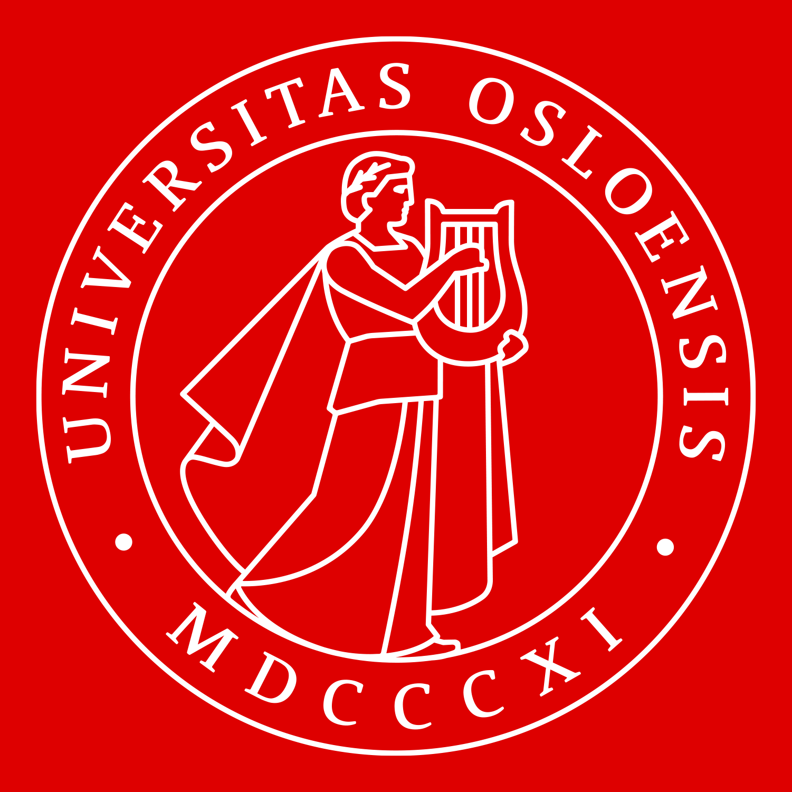
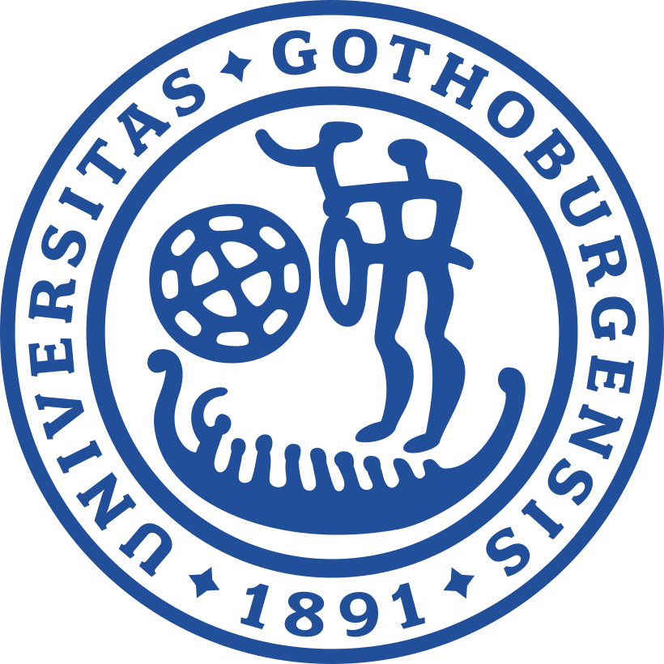

## STV1010

::: {.grid}

::: {.g-col-12 .g-col-md-2}

:::

::: {.g-col-12 .g-col-md-10}

**Fall 2021** **Fall 2022**

Seminar instructor. Overall leader of seminar instructors for the fall 2022 term. 

:::

:::

## STV1020

::: {.grid}

::: {.g-col-12 .g-col-md-2}

:::

::: {.g-col-12 .g-col-md-10}

**Spring 2022**

Seminar Instructor for R labs.

:::

:::

## OADM2100

::: {.grid}

::: {.g-col-12 .g-col-md-2}

:::

::: {.g-col-12 .g-col-md-10}

**Spring 2021**

Seminar instructor.  

:::

:::

## SK1214

::: {.grid}

::: {.g-col-12 .g-col-md-2}

:::

::: {.g-col-12 .g-col-md-10}

**Fall 2024** **Spring 2025** **Fall 2025** **Spring 2026** **Fall 2026**

Seminar instructor for three terms, lecturer for last three terms. 

:::

:::

## SK1113

::: {.grid}

::: {.g-col-12 .g-col-md-2}

:::

::: {.g-col-12 .g-col-md-10}

**Fall 2025** **Spring 2026** **Fall 2026**

Seminar instructor. 

:::

:::

## SF2324

::: {.grid}

::: {.g-col-12 .g-col-md-2}

:::

::: {.g-col-12 .g-col-md-10}

**Fall 2026**

Lab seminar instructor for STATA labs. 

:::

:::

## Supervision

::: {.grid}

::: {.g-col-12 .g-col-md-2}

:::

::: {.g-col-12 .g-col-md-10}

Both Bachelor and Master supervision. 

:::

:::